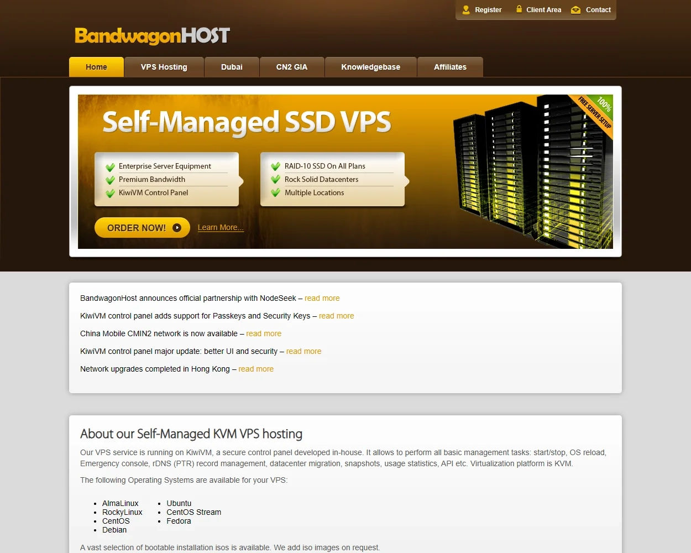
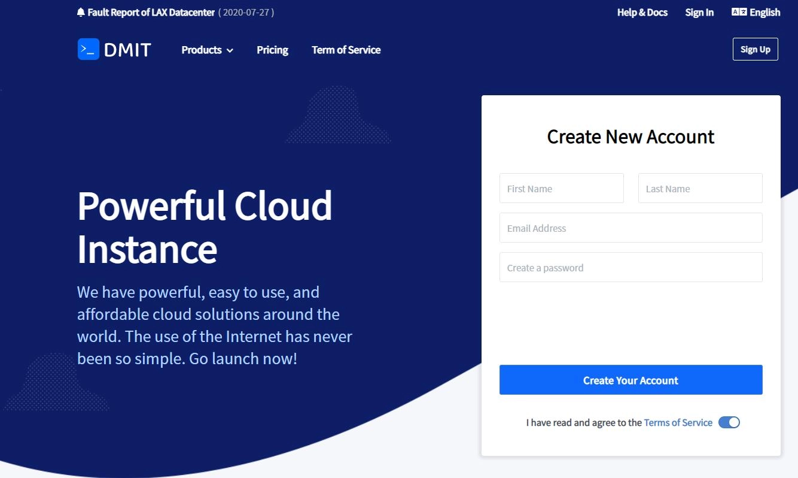
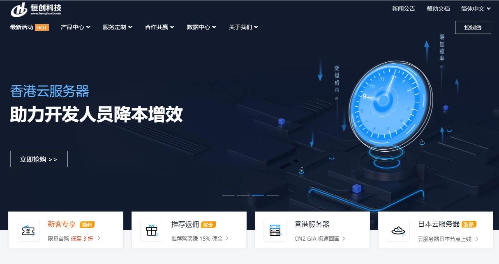
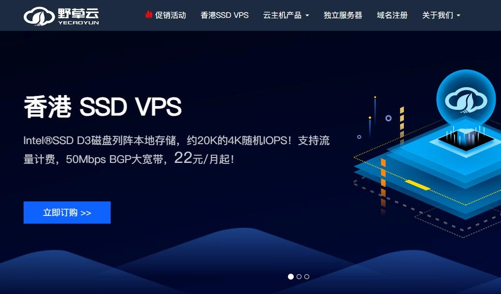
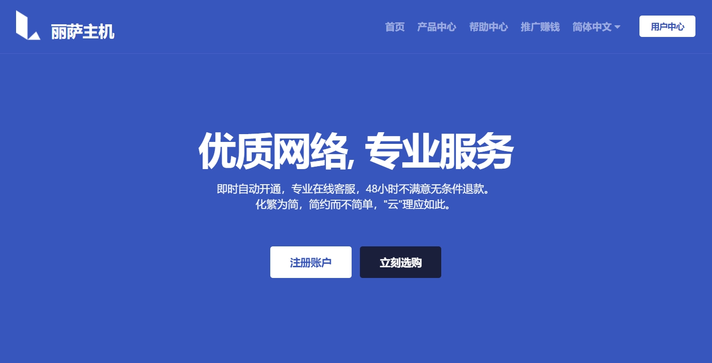
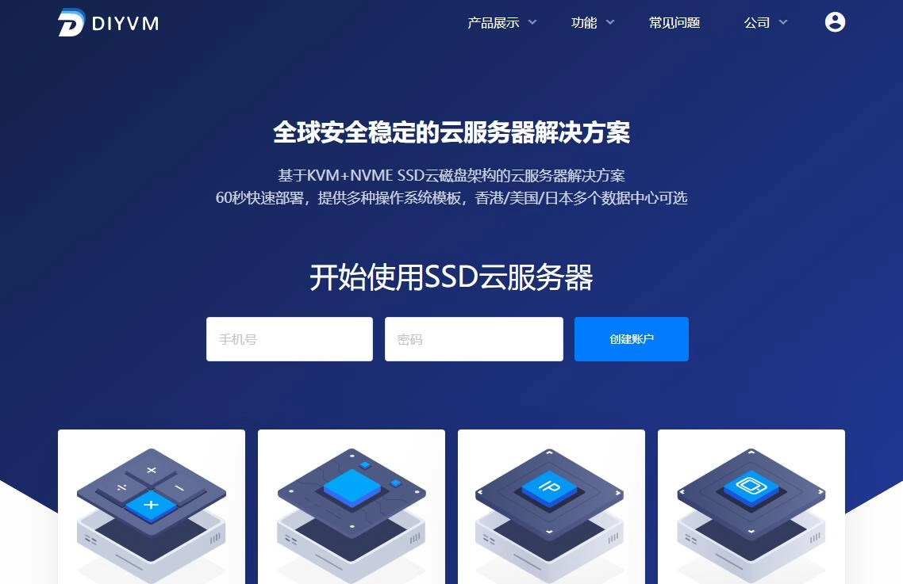

# 2025香港VPS怎么选？聊聊哪家真的值得买

最近总有人问我："香港VPS到底选哪家好？"说实话，这问题我也琢磨挺久的。作为一个折腾服务器好几年的人，今天就跟你们唠唠香港VPS这档子事儿。

先说为什么要选香港VPS——三个字：**快、稳、省心**。你的网站如果主要给国内用户看，香港VPS的延迟基本在30-50ms，比美国服务器快多了。而且香港网络环境比较自由，不用担心各种限制，用着踏实。除了建站，跨境电商、数据中转什么的都能用，反正不需要备案，上线快，灵活性高。对于既要服务国内又要面向海外市场的人来说，基本就是**标配**了。

好了，废话不多说，接下来我挑几家在性能、稳定性、防御能力上确实还不错的香港VPS服务商，帮你少踩坑。

---

## 1. 搬瓦工（BandwagonHost）- 网络质量确实硬

**为什么排第一？** 因为搬瓦工的CN2 GIA线路是真的香。

搬瓦工在香港VPS市场的地位就像苹果在手机市场，虽然价格不是最便宜的，但网络质量确实是标杆。它的CN2 GIA线路直连大陆，就算晚高峰时段，连接质量也很稳定。

控制面板功能挺丰富的，一键重装系统、快照备份、流量统计都有。最让人喜欢的是IP更换功能，虽然要额外付费，但对于需要换IP的人来说确实方便。

**实测情况：**

我用了快两年了，速度测试结果一直很稳。广东地区ping值基本在15-25ms，晚高峰也很少超过40ms。下载速度经常能跑满带宽，看4K视频都不卡。如果你正在考虑稳定性和速度兼顾的方案，👉 [搬瓦工的CN2 GIA线路值得重点关注](https://bandwagonhost.com/aff.php?aff=79616)，特别适合对网络质量有较高要求的场景。

**优点：**
- CN2 GIA线路质量确实好
- 控制面板功能丰富，一键重装系统
- 口碑好，用户多，遇到问题容易找到解决方案
- 流量重置、IP更换等功能齐全

**缺点：**
- **经常缺货！** 这是最大的痛点，一上架就被抢光
- 价格不算便宜，但考虑到线路质量还算值
- 客服主要是工单系统,响应速度一般

### 抢购小技巧

- 关注官方推特 @BandwagonHost
- 加入电报群获取补货通知
- 使用库存监控工具
- 准备好支付宝，补货时手要快

---

## 2. DMIT - 技术流的选择

DMIT在性能对比中经常能拿高分，技术实力确实不错。虽然知名度不如搬瓦工，但自建机房和网络优化能力值得认可。比较适合对技术有要求、追求稳定性的人。

DMIT的特色是提供多种网络线路选择，你可以根据实际需求选BGP多线、CN2等不同线路。NVMe固态硬盘的I/O性能表现也不错，跑数据库或需要频繁读写的场景特别合适。

**实测情况：**

DMIT的香港机房网络优化得不错，到大陆各地的速度都比较均衡。我测过他们的CN2套餐，延迟控制得很好，丢包率也低。

**优点：**
- 多种线路可选，能根据需求选择
- NVMe固态硬盘，I/O性能优秀
- 技术支持专业，客服回复及时
- 机房自建，稳定性有保障

**缺点：**
- 价格偏高，预算有限的话可能吃不消
- 知名度不如搬瓦工，新手可能不太了解
- 某些套餐限制较多

---

## 3. 恒创科技（HengHost）- 老牌商家的稳健选择

恒创科技2010年就成立了，在香港VPS市场有超过10年运营经验。这家公司隶属于香港SonderCloud Limited，是APNIC和ARIN会员单位，资质齐全，有自己的网络资源。

恒创的特色是大带宽产品线，特别适合需要处理大量数据传输的场景，比如流媒体、文件分发什么的。50Mbps起步的带宽配置在同价位产品中算是有优势的。

**优点：**
- 十年以上运营经验，品牌信誉不错
- 资质完备，APNIC和ARIN会员身份
- 产品线丰富，从入门到企业级都有
- 大带宽产品在市场上有竞争力
- 中文客服支持，服务本土化程度高

**缺点：**
- 技术创新方面相对保守
- 价格优势不如部分新兴商家明显
- 部分产品线的性价比还有提升空间

---

## 4. 野草云 - 国产的良心选择

野草云作为新兴的国产香港VPS商家，算是做得比较用心的。虽然成立时间不长，但凭着不错的性价比和贴心的中文服务迅速占据了一席之地。特别适合预算有限但又需要香港VPS的人。

野草云的价格策略挺激进，入门级套餐年付不到300元，这价格在香港VPS市场确实有竞争力。更重要的是，没有采用常见的首年优惠、续费涨价策略，续费价格和首年保持一致。

**实测情况：**

测评结果还是不错的，特别是考虑到价格。我用他们的CN2套餐测过，广东地区延迟在25-35ms左右，速度虽然比不上搬瓦工，但日常使用完全够了。

**优点：**
- 价格便宜，性价比高
- 中文客服，沟通无障碍
- 支持国内支付方式，付款方便
- 针对大陆网络有优化

**缺点：**
- 规模相对较小，稳定性有待时间检验
- 带宽相对保守，不适合大流量应用
- 知名度不高，口碑积累还需要时间

---

## 5. 丽萨主机 - 入门级的不错选择

丽萨主机作为专注入门级市场的VPS提供商，以超低的价格门槛和简化的操作流程吸引了大量新手。虽然在性能和稳定性方面不如其他商家,但作为学习和测试环境确实不错。

丽萨主机的价格策略非常明确，就是要做到行业最低价格之一。体验版套餐月付仅19元，这价格几乎是香港VPS市场的底线了。当然，配置也相应地比较基础。

**实测情况：**

作为入门级选择，丽萨主机的表现中规中矩。网络速度谈不上惊艳，但基本的建站需求能满足。客服响应还算及时，遇到问题能得到解决。

**优点：**
- 价格实惠，适合初学者
- 中文服务，新手友好
- 基础功能齐全

**缺点：**
- 性能一般，不适合高要求应用
- 流量配额相对较小
- 技术实力有限

---

## 6. DIYVM - 动态IP专家

DIYVM 2009年就成立了，在香港VPS市场有着独特定位。最大的特色是支持动态IP功能，对于需要香港动态VPS或站群应用的人来说有特殊价值。

DIYVM的香港VPS基于XEN虚拟化技术，提供真正的独享资源。动态IP功能通过技术手段实现IP地址的定期更换，在需要规避IP限制的应用场景中挺有用。

**优点：**
- 支持动态IP，满足特殊需求
- 无限流量政策，大流量应用友好
- 全面支持Windows系统
- 价格相对便宜，适合预算有限的人
- 客服服务态度好，问题处理及时

**缺点：**
- 网络质量相比顶级商家有差距
- 公司规模有限，抗风险能力较弱
- 带宽相对较小，峰值性能受限
- 技术创新能力有待提升

---

## 选购香港VPS的几个建议

**1. 先确定用途**

你是用来建站、科学上网还是跑项目？不同用途对配置要求差别很大。一般来说：
- 个人博客：1核1G就够了
- 小型网站：1核2G比较稳妥
- 跑应用程序：2核4G起步

**2. 关注线路质量**

这点特别重要！测速时要看晚高峰的表现，因为白天快不代表晚上也快。推荐选择CN2 GIA或者BGP多线的机房。

**3. 价格别贪便宜**

那些几十块钱一年的"香港VPS"，十有八九是忽悠人的。真正的香港机房成本不低，太便宜的要么是假的香港机房，要么就是超售严重。

---

## 如何选择适合自己的香港VPS？

### 按预算选择

- **预算充足（60+美元/月）：** DMIT是首选，技术实力强，稳定性好
- **中等预算（30-60美元/月）：** 搬瓦工（如果能买到），性价比最高
- **预算有限（30元-50元/月）：** 野草云或丽萨主机，国产服务更贴心

### 按用途选择

- **个人博客建站：** 野草云或丽萨主机够用了
- **外贸网站：** 推荐DMIT，国际线路优化更好
- **科学上网：** 搬瓦工CN2 GIA是首选（合规使用）
- **企业应用：** DMIT的稳定性更有保障

### 按技术水平选择

- **新手用户：** 野草云或丽萨主机，中文服务友好
- **有经验用户：** 搬瓦工或DMIT，功能更丰富
- **技术大神：** DMIT，可玩性更高

---

## 选购注意事项

1. **先测试后购买**：大部分商家都提供测试IP，一定要先测试网络质量
2. **看退款政策**：选择支持退款的商家，不满意可以退
3. **关注续费价格**：有些商家首年便宜，续费就涨价了
4. **备份很重要**：不管选哪家，定期备份数据是必须的
5. **线路类型**：优先选CN2直连或者BGP优化线路，速度和稳定性更好
6. **带宽和流量**：如果你跑视频站或者做下载，带宽一定要大，不然很快就限速
7. **售后支持**：尽量选择24小时技术支持的商家，出问题能及时解决

---

## 常见问题解答

**Q1：香港VPS真的不用备案吗？**

对的，香港VPS无需备案是真的。香港不在大陆管辖范围内，所以不需要走ICP备案流程。这也是很多人选择香港VPS的重要原因。不过要注意，如果你的域名指向香港服务器，但内容还是面向大陆用户，建议内容合规，别搞违法的东西。

**Q2：香港VPS月流量够用吗？**

这个得看具体商家和套餐。一般来说：
- 个人博客：500GB/月绰绰有余
- 小型网站：1TB/月基本够用
- 视频网站：那就得选不限流量的了

大部分香港VPS商家给的流量都比较大方，不像某些美国商家抠抠搜搜的。

**Q3：香港VPS延迟多少算正常？**

香港VPS ping值测试结果：
- 大陆用户：20-50ms算正常，超过100ms就有点高了
- 广东地区：通常10-30ms，最快的
- 北方地区：30-60ms，也还可以接受

如果你测试延迟超过100ms，那可能线路有问题，建议换家试试。

**Q4：香港VPS价格为啥比美国贵？**

主要几个原因：
- 机房成本高：香港寸土寸金，机房租金贵
- 带宽费用高：国际带宽成本本来就不便宜
- 需求量大：大陆用户需求旺盛，物以稀为贵

所以能做到便宜的商家真不多。

**Q5：新手应该选多大配置？**

配置推荐：
- 完全新手：1核1G内存，先试试水
- 有点经验：1核2G内存，比较稳妥的选择
- 跑多个项目：2核4G内存，比较宽裕

别一上来就买很高的配置，大部分情况下都用不满。

**Q6：如何测试香港VPS速度？**

几个测试方法：
- Ping测试：最基础的延迟测试
- 路由跟踪：看数据包走的路径
- 下载测试：实际下载个文件试试速度
- 晚高峰测试：晚上8-10点是关键时段

很多商家都提供测试IP，买之前一定要先测一下。

**Q7：香港VPS能搭建网站吗？**

当然可以！香港VPS建站是很常见的用法。优势：
- 不用备案，省事
- 对大陆访问友好
- 国际访问也不错
- 各种程序都能跑

唯一要注意的就是选择靠谱的商家，别选那种三天两头宕机的。

**Q8：出现问题怎么联系客服？**

这个得看商家：
- 国外商家：通常是邮件、工单，英文交流
- 国内商家：在线客服、电话、工单都有
- 小商家：可能就QQ或者微信

建议选择客服响应及时的商家，出问题能快速解决。

---

选VPS这事儿，真的是一分钱一分货。便宜虽然很诱人，但稳定性和售后服务往往跟不上。特别是如果你要用来做正经业务，千万别因为省几十块钱最后损失更多。另外，买之前一定要看清楚退款政策，最好选择支持试用或者短期退款的商家。毕竟网络这东西，只有自己用了才知道合不合适。如果你正在寻找稳定可靠的香港VPS方案，👉 [搬瓦工提供的多种配置选择](https://bandwagonhost.com/aff.php?aff=79616)能够满足从个人博客到企业应用的不同需求，值得根据自己的实际场景进行对比。

好了，今天就聊到这里。有其他问题，随时交流！
